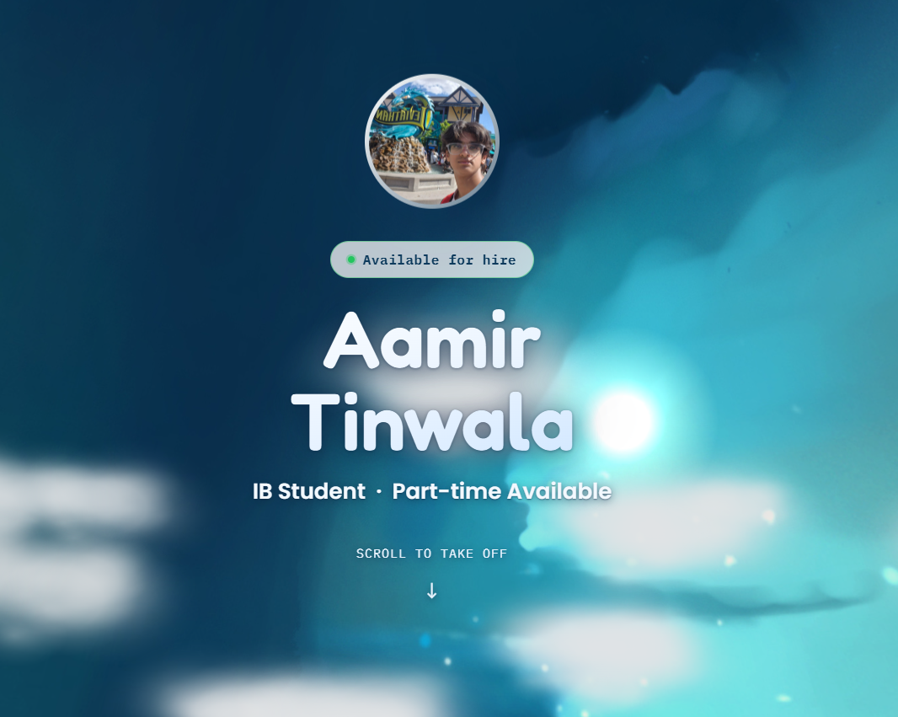
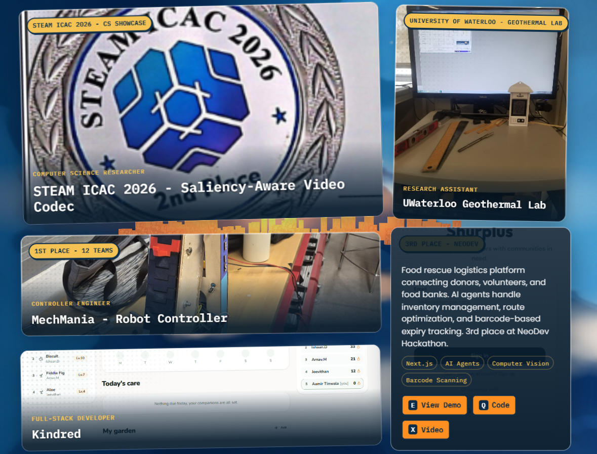
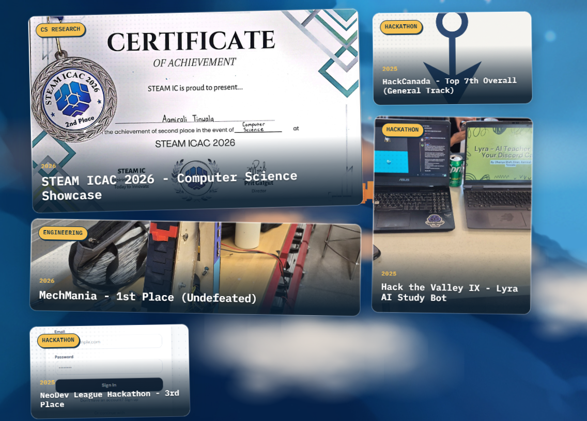
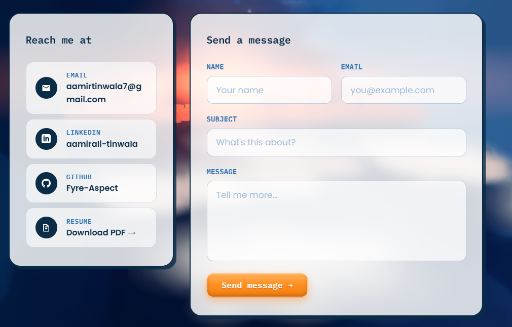
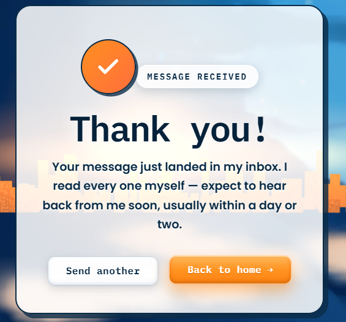
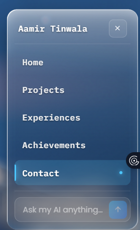

# Aamir Tinwala's Portfolio

This is basically a continuation of my portfolio website bascially fully revamped I felt that my old look adn my old feel on the portfolio was ugly and not subpar with what AI and claude can acheive today. So taking that in consideration I wanted to improve upon that so that is why I contuinued this project from before nad imrpoved UI/UX not only that I added a bunch of things 
that was pending fo rme to add. So I added a few experiences, acheivements and proejcts througout my school year basically for me to larp on about.

## What It Is

It is a Next.js portfolio built with TypeScript and a custom visual style. Thsi site include 5 pages first homepage is a scrollable navigator that shows my top 3 projects and top 3 most recent experiences that I have currently. 

Then it progresses to teh projects tab which is heavily inspired from teh projects thing from horizons UI and was carried forward to my website so it feels nicer and looks like it. It encompassses all my good projects made at hackathons, competeitions and for this Horizon stuff.

Moving to teh expereicne is a nice timeline which takes you through my past 3 years and what I have done in those 3 years when it comes to volunteering/interning/competitions/hackathons etc. and it takes how many hours I spent on it and how long it lasted or if it's still going on.

Then navigate to the achievments section where it's split up into 3 categories one is Competition wins, Academic excellence adn community and personal achievement. Where I basically just showcase what out of these experiences and projects what was acheived more formally.

Navigating to the contact page whcih is something that was quite of an issue in the past with rate limits and stuff like that so I had to revamp it a bit so that it can be stopped from injectors.

The goal was to make the portfolio feel polished, memorable, and easy to explore on both desktop and mobile.

## What It Was Before

Before this version, the portfolio was much simpler. It was more like a basic personal site than a full experience. It just didnt feel like a good evxperience to go thorugh it and also after making a bit of these changes on firebase analytics the retention rate shot up and people geniunely stayed on it longer.

## Where AI Was Used

AI is used in two main ways here. not just for coding a lot of the project but also Gemini API key was used to act as me a personal chatbot to navigate confused users throughout my portfolio nad I use AI to code a lot of the UI and make it look a lot cleaner than before.

## Tech Stack

- Next.js
- React
- TypeScript
- CSS Modules and global CSS
- Framer Motion
- Three.js / React Three Fiber
- Firebase
- Google Gemini API

